```{r setup, include = FALSE}
library(tidycensus)
library(tidyverse)
options(tigris_use_cache = TRUE)

```

## About me

-   Professor of Geography at TCU

-   Spatial data science researcher and consultant

-   Package developer: **tidycensus**, **tigris**, **mapgl**, **mapboxapi**, **crsuggest**, **idbr** (R), **pygris** (Python)

-   Book: [*Analyzing US Census Data: Methods, Maps and Models in R*](https://walker-data.com/census-r/)

## SSDAN webinar series

-   Wednesday, February 5: [Analyzing Data from the 2023 American Community Survey in R](https://walker-data.com/umich-workshop-2025/acs-2023/)

-   Wednesday, February 12: [Working with Decennial Census Data in R](https://walker-data.com/umich-workshop-2025/decennial-census/)

-   **Today: Mapping and Spatial Analysis with US Census Data in R**

## Today's agenda

-   Hour 1: How to get and explore spatial US Census data using R

-   Hour 2: A tour of map types with R, mapgl, and US Census data

-   Hour 3: Advanced workflows: national and time-series mapping

# US Census data: an overview

## R and RStudio

-   R: programming language and software environment for data analysis (and wherever else your imagination can take you!)

-   RStudio: integrated development environment (IDE) for R developed by [Posit](https://posit.co/)

-   Posit Cloud: run RStudio with today's workshop pre-configured at <https://posit.cloud/content/9689451>

# Setup: RStudio and basic data structures in R

## The Decennial US Census

-   Complete count of the US population mandated by Article 1, Sections 2 and 9 in the US Constitution

-   Directed by the US Census Bureau (US Department of Commerce); conducted every 10 years since 1790

-   Used for proportional representation / congressional redistricting

-   Limited set of questions asked about race, ethnicity, age, sex, and housing tenure

## The American Community Survey

-   Annual survey of 3.5 million US households

-   Covers topics not available in decennial US Census data (e.g. income, education, language, housing characteristics)

-   Available as 1-year estimates (for geographies of population 65,000 and greater) and 5-year estimates (for geographies down to the block group)

-   Data delivered as *estimates* characterized by *margins of error*

## How to get Census data

-   [data.census.gov](https://data.census.gov) is the main, revamped interactive data portal for browsing and downloading Census datasets

-   [The US Census **A**pplication **P**rogramming **I**nterface (API)](https://www.census.gov/data/developers/data-sets.html) allows developers to access Census data resources programmatically

## tidycensus

::::: columns
::: {.column width="70%"}
-   R interface to the Decennial Census, American Community Survey, Population Estimates Program, Migration Flows, and Public Use Microdata Series APIs

-   First released in 2017; over 600,000 downloads from the Posit CRAN mirror
:::

::: {.column width="30%"}

:::
:::::

## tidycensus: key features

::: incremental
-   Wrangles Census data internally to return tidyverse-ready format (or traditional wide format if requested);

-   **Automatically downloads and merges Census geometries to data for mapping**;

-   Includes a variety of analytic tools to support common Census workflows;

-   States and counties can be requested by name (no more looking up FIPS codes!)
:::

## Getting started with tidycensus

-   To get started, install the packages you'll need for today's workshop

-   If you are using the Posit Cloud environment, these packages are already installed for you

```{r install-packages, eval = FALSE}
install.packages(c("tidycensus", "tidyverse", "mapview", "mapgl", "quarto"))
```

## Optional: your Census API key

-   tidycensus (and the Census API) can be used without an API key, but you will be limited to 500 queries per day

-   Power users: visit <https://api.census.gov/data/key_signup.html> to request a key, then activate the key from the link in your email.

-   Once activated, use the `census_api_key()` function to set your key as an environment variable

```{r api-key, eval = FALSE}
library(tidycensus)

census_api_key("YOUR KEY GOES HERE", install = TRUE)
```

# Getting spatial US Census data

## Spatial Census data: the old way

Traditionally, getting "spatial" Census data required:

::: incremental
-   Fetching shapefiles from the Census website;

-   Downloading a CSV of data, then cleaning and formatting it;

-   Loading geometries and data into your GIS of choice;

-   Aligning key fields in your GIS and joining your data
:::

## Getting started with tidycensus

-   Your core functions in tidycensus are `get_decennial()` for decennial Census data, and `get_acs()` for ACS data

-   Required arguments are `geography` and `variables`

```{r decennial}
#| code-line-numbers: "|2|3|4|5"

texas_income <- get_acs(
  geography = "county",
  variables = "B19013_001",
  state = "TX",
  year = 2023
)
```

------------------------------------------------------------------------

-   ACS data are returned with five columns: `GEOID`, `NAME`, `variable`, `estimate`, and `moe`

```{r view-decennial}
texas_income
```

## Spatial Census data with tidycensus

-   Use the argument `geometry = TRUE` to get pre-joined geometry along with your data!

```{r}
#| code-line-numbers: "|6"

texas_income_sf <- get_acs(
  geography = "county",
  variables = "B19013_001",
  state = "TX",
  year = 2023,
  geometry = TRUE
)
```

------------------------------------------------------------------------

-   We can now make a simple map with `plot()`:

```{r}
plot(texas_income_sf['estimate'])
```

## Looking under the hood: *simple features* in R

::::: columns
::: column

:::

::: column
-   The sf package implements a *simple features data model* for vector spatial data in R

-   Vector geometries: *points*, *lines*, and *polygons* stored in a list-column of a data frame
:::
:::::

------------------------------------------------------------------------

-   Spatial data are returned with five data columns: `GEOID`, `NAME`, `variable`, `estimate`, and `moe`, along with a `geometry` column representing the shapes of locations

```{r view-acs-1yr}
texas_income_sf
```

------------------------------------------------------------------------

## Interactive viewing with `mapview()`

::::: columns
::: column

:::

::: column
-   The **mapview** package allows for interactive viewing of spatial data in R

```{r tx-mapview, eval = FALSE}
library(mapview)

mapview(
  texas_income_sf, 
  zcol = "estimate"
)
```
:::
:::::

------------------------------------------------------------------------

```{r tx-mapview-show, out.width = "850px", echo = FALSE}
library(mapview)

mapview(texas_income_sf, zcol = "estimate")
```

# Understanding geography and variables in tidycensus

## US Census Geography

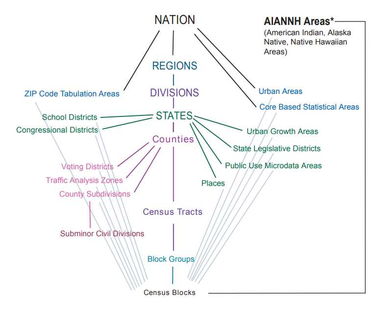

## Geography in tidycensus

-   Information on available geographies, and how to specify them, can be found [in the tidycensus documentation](https://walker-data.com/tidycensus/articles/basic-usage.html#geography-in-tidycensus-1)

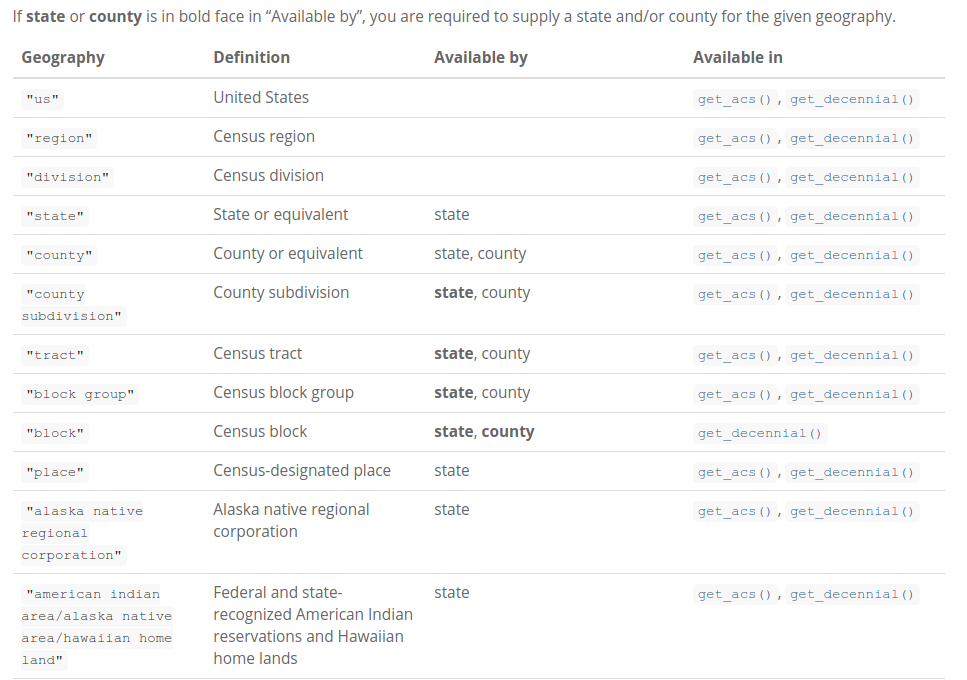{width="600"}

## Searching for variables

-   To search for variables, use the `load_variables()` function along with a year and dataset

-   For the 2023 5-year ACS, use `"acs5"` for the Detailed Tables; `"acs5/profile"` for the Data Profile; `"acs5/subject"` for the Subject Tables; and `"acs5/cprofile"` for the Comparison Profile

-   The `View()` function in RStudio allows for interactive browsing and filtering

```{r search-variables, eval = FALSE}
vars <- load_variables(2023, "acs5")

View(vars)

```

------------------------------------------------------------------------

## Small-area spatial demographic data

-   Smaller areas like Census tracts or block groups are available with `geography = "tract"` or `geography = "block group"`; one or more counties can optionally be specified to focus your query

```{r king-income}
#| code-line-numbers: "|2|5,6"

nyc_income <- get_acs(
  geography = "tract",
  variables = "B19013_001",
  state = "NY",
  county = c("New York", "Kings", "Queens",
             "Bronx", "Richmond"),
  year = 2023,
  geometry = TRUE
)

```

------------------------------------------------------------------------

```{r}
mapview(nyc_income, zcol = "estimate")
```

---
class: middle, center, inverse

## Spatial data structure in tidycensus
---

## "Tidy" or long-form data

-   The default data structure returned by **tidycensus** is "tidy" or long-form data, with variables by geography stacked by row

-   For spatial data, this means that geometries will also be stacked, which is helpful for group-wise analysis and visualization

------------------------------------------------------------------------

## "Tidy" or long-form data

```{r tidy-data}
san_diego_race <- get_acs(
  geography = "tract",
  variables = c(
    Hispanic = "DP05_0075",
    White = "DP05_0082",
    Black = "DP05_0083",
    Asian = "DP05_0085"
  ),
  state = "CA",
  county = "San Diego",
  geometry = TRUE,
  year = 2023
)

```

------------------------------------------------------------------------

```{r show-tidy-data}
san_diego_race
```

------------------------------------------------------------------------

## "Wide" data

-   The argument `output = "wide"` spreads Census variables across the columns, returning one row per geographic unit and one column per variable

-   This will be a more familiar data structure for traditional desktop GIS users

## "Wide" data

```{r wide-data}
#| code-line-numbers: "|12"

san_diego_race_wide <- get_acs(
  geography = "tract",
  variables = c(
    Hispanic = "DP05_0075",
    White = "DP05_0082",
    Black = "DP05_0083",
    Asian = "DP05_0085"
  ),
  state = "CA",
  county = "San Diego",
  geometry = TRUE,
  output = "wide",
  year = 2023
)
```

------------------------------------------------------------------------

```{r show-wide-data}
san_diego_race_wide
```

---
class: middle, center, inverse

## Working with Census geometry
---

## Census geometry and the **tigris** R package

::::: columns
::: column

:::

::: column
-   tidycensus uses the **tigris** R package internally to acquire Census shapefiles

-   By default, the [Cartographic Boundary shapefiles](https://www.census.gov/geographies/mapping-files/time-series/geo/carto-boundary-file.html) are used, which are pre-clipped to the US shoreline
:::
:::::

------------------------------------------------------------------------

## Problem: interior water areas

-   Let's re-visit the NYC income map

-   Water areas throughout the city are included within tract polygons, making patterns difficult to observe for those who know the area

-   `erase_water()` in the **tigris** package offers a solution; it automates the removal of water areas from your shapes

-   Tips: tune the `area_threshold` to selectively remove water area; use `cb = FALSE` to avoid sliver polygons

------------------------------------------------------------------------

```{r}
#| code-line-numbers: "|8"

nyc_income_tiger <- get_acs(
  geography = "tract",
  variables = "B19013_001",
  state = "NY",
  county = c("New York", "Kings", "Queens",
             "Bronx", "Richmond"),
  year = 2023,
  cb = FALSE,
  geometry = TRUE
)
```

------------------------------------------------------------------------

-   `area_threshold = 0.5` means we are removing the largest 50% of water areas in the area

```{r nyc-erase}
#| code-line-numbers: "|7"
#| message: false

library(tigris)
library(sf)
sf_use_s2(FALSE)

nyc_erase <- erase_water(
  nyc_income_tiger,
  area_threshold = 0.5,
  year = 2023
)

```

------------------------------------------------------------------------

```{r}
mapview(nyc_erase, zcol = "estimate")
```

------------------------------------------------------------------------

## Part 1 exercises

1.  Use the `load_variables()` function to find a variable that interests you that we haven't used yet.

2.  Use `get_acs()` to fetch spatial ACS data on that variable for a geography and location of your choice, then use `mapview()` to display your data interactively.

# A tour of map types with R, mapgl, and US Census data

## Mapping in R

-   R has a robust set of tools for cartographic visualization that make it a suitable alternative to desktop GIS software in many instances

-   Popular packages for cartography include **ggplot2**, **tmap**, and **mapsf**

-   Today, we'll be focusing on the brand-new **mapgl** R package I released in 2024 for high-performance interactive mapping

## mapgl

-   mapgl: a new R package for high-performance interactive mapping

-   Offers an R interface to the [Mapbox GL JS](https://docs.mapbox.com/mapbox-gl-js/api/) and [MapLibre GL JS](https://maplibre.org/maplibre-gl-js/docs/) libraries

-   Today, we'll be using MapLibre which we can use without an account / API key

# A quick introduction to mapgl

## Getting started with mapgl and MapLibre

```{r}
library(mapgl)
maplibre()
```

## Globe projections in MapLibre

```{r}
maplibre() |> set_projection("globe")
```

## Mapping data with fill layers

-   Data are added to MapLibre maps as *sources* which are then displayed as *layers*

-   Polygon layers can be displayed as *fill layers* with the `add_fill_layer()` function

-   Let's grab some data on median age in Phoenix to illustate this

------------------------------------------------------------------------

```{r choro1}
maricopa_age <- get_acs(
  geography = "tract",
  variables = "B01002_001",
  state = "AZ",
  county = "Maricopa",
  geometry = TRUE,
  year = 2023
)
```

------------------------------------------------------------------------

```{r}
#| eval: false

maplibre(bounds = maricopa_age) |> 
  add_fill_layer(
    id = "age",
    source = maricopa_age
  )
```

------------------------------------------------------------------------

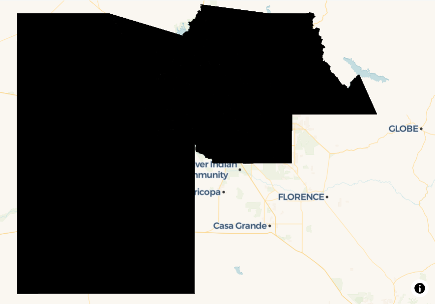

## Continuous choropleth with styling

-   We can apply some styling to customize our choropleth maps

-   For continuous choropleth maps, we define an `interpolate()` expression

```{r choro2}
#| eval: false

cont_choro <- maplibre(bounds = maricopa_age) |> 
  add_fill_layer(
    id = "age",
    source = maricopa_age,
    fill_color = interpolate(
      column = "estimate",
      values = c(4, 77),
      stops = c("lightblue", "darkblue"),
      na_color = "lightgrey"
    ),
    fill_opacity = 0.7
  )
```

------------------------------------------------------------------------

```{r}
#| eval: false

cont_choro
```

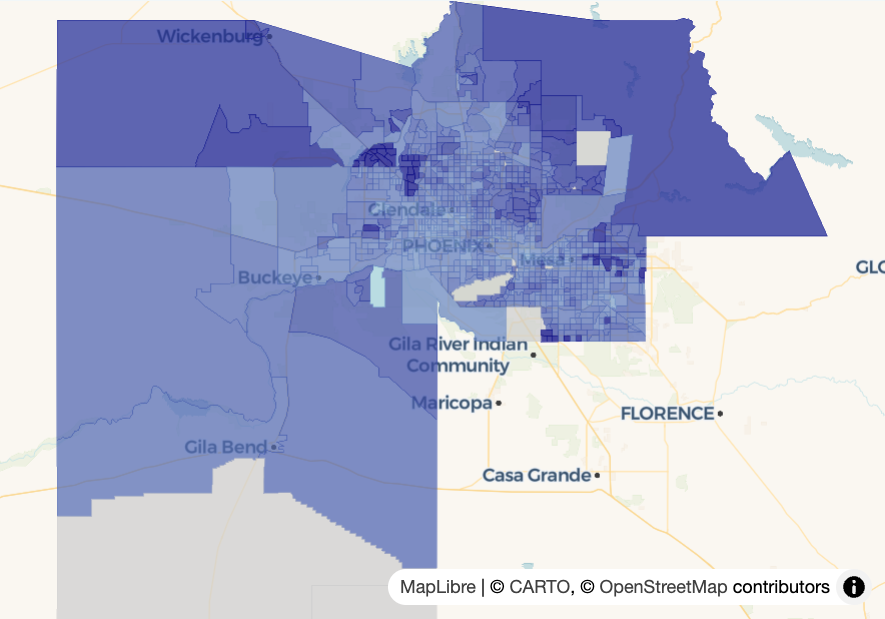

## Classed choropleth

-   We can also create a binned choropleth with a *step expression*

-   Let's first grab some colors to use for the map:

```{r}
library(viridisLite)

colors <- viridis(5)
```

## Classed choropleth

```{r choro3}
#| eval: false

classed_choro <- maplibre(
  bounds = maricopa_age
) |> 
add_fill_layer(
  id = "maricopa",
  source = maricopa_age,
  fill_color = step_expr(
    column = "estimate",
    base = colors[1],
    stops = colors[2:5],
    values = c(25, 40, 55, 70),
    na_color = "lightgrey"
  ),
  fill_opacity = 0.6
) 
```

------------------------------------------------------------------------

```{r choro3-show}
#| eval: false

classed_choro
```

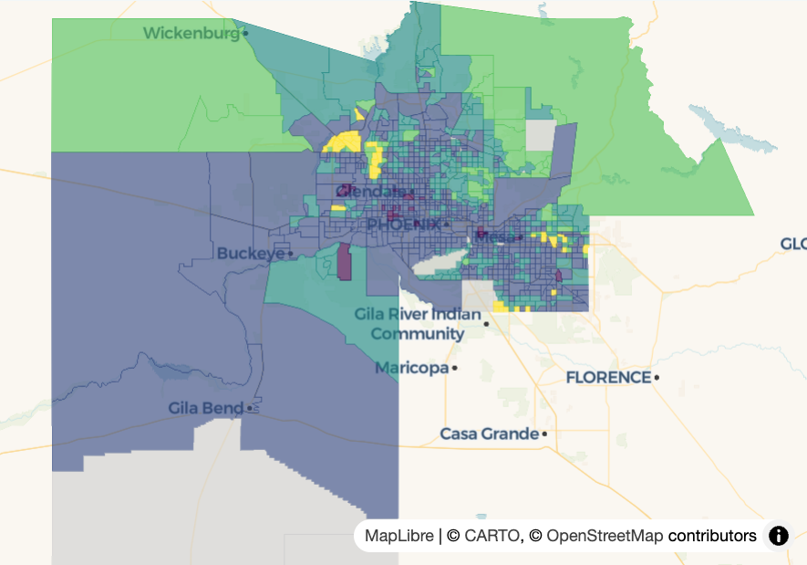

## Adding a legend

```{r}
#| eval: false

classed_choro |> 
add_legend(
  "Median age",
  values = c(
    "Under 25",
    "25 to 40",
    "40 to 55",
    "55 to 70",
    "70 and up"
  ),
  colors = colors,
  type = "categorical"
)
```

------------------------------------------------------------------------

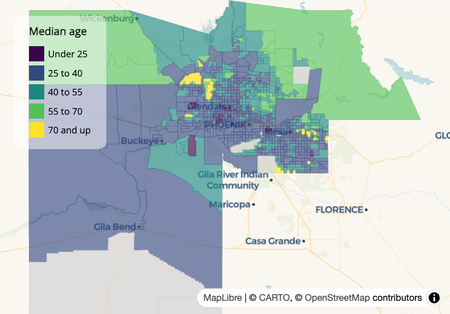

## Adding interaction effects

```{r facets}
#| eval: false

choro_with_effects <- maplibre(
  bounds = maricopa_age
) |> 
add_fill_layer(
  id = "maricopa",
  source = maricopa_age,
  fill_color = step_expr(
    column = "estimate",
    base = colors[1],
    stops = colors[2:5],
    values = c(25, 40, 55, 70),
    na_color = "lightgrey"
  ),
  fill_opacity = 0.6,
  tooltip = "estimate",
  hover_options = list(
    fill_opacity = 1,
    fill_color = "red"
  )
) 
```

------------------------------------------------------------------------

```{r}
#| eval: false

choro_with_effects
```

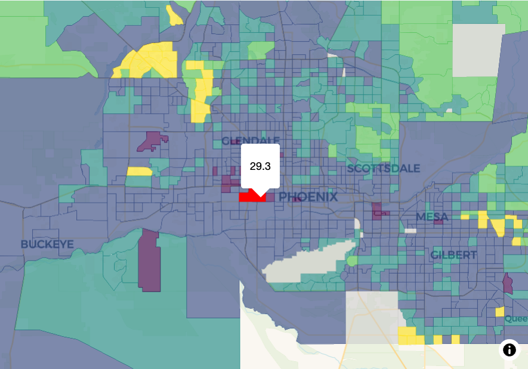

## Mapping count data

::::: columns
::: column
-   At times, you'll want to show variations in *counts* rather than rates on your maps of ACS data

-   Choropleth maps are poorly suited for count data

-   Let's grab some count data for race / ethnicity and consider some alternatives
:::

::: column
```{r orange-race-counts}
#| eval: false

san_diego_race <- get_acs(
  geography = "tract",
  variables = c(
    Hispanic = "DP05_0076",
    White = "DP05_0082",
    Black = "DP05_0083",
    Asian = "DP05_0085"
  ),
  state = "CA",
  county = "San Diego",
  geometry = TRUE,
  year = 2023
)
```
:::
:::::

------------------------------------------------------------------------

## Graduated symbol maps

-   Graduated symbol maps show difference on a map with the size of symbols (often circles)

-   They are better for count data than choropleth maps as the shapes are directly comparable (unlike differentially-sized polygons)

-   In mapgl, we can use *circle layers* to make graduated symbol maps

------------------------------------------------------------------------

```{r orange-race-centroids}
#| eval: false

library(sf)

san_diego_hispanic <- filter(
  san_diego_race, 
  variable == "Hispanic"
)

san_diego_centers <- st_centroid(san_diego_hispanic)

```

------------------------------------------------------------------------

```{r plot-graduated}
#| eval: false

grad_symbol <- maplibre(
  style = carto_style("positron"),
  bounds = san_diego_centers
) |> 
  add_circle_layer(
    id = "circles",
    source = san_diego_centers,
    circle_radius = step_expr(
      column = "estimate",
      values = c(500, 1000, 1500, 2500),
      base = 2,
      stops = c(4, 6, 8, 10),
    ),
    circle_opacity = 0.6,
    circle_color = "navy",
    tooltip = "estimate"
  ) 
```

------------------------------------------------------------------------

```{r}
#| eval: false

grad_symbol
```

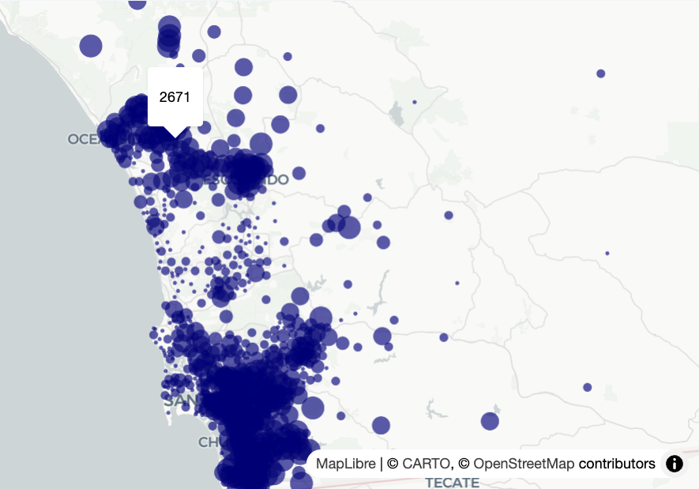

## Graduated symbol legends

```{r}
#| eval: false

grad_symbol |>
  add_legend(
    "Hispanic population",
    values = c(
      "Under 500",
      "500-1000",
      "1000-1500",
      "1500-2500",
      "2500 and up"
    ),
    sizes = c(2, 4, 6, 8, 10),
    colors = "navy",
    type = "categorical",
    circular_patches = TRUE,
    position = "top-right"
  )
```

------------------------------------------------------------------------

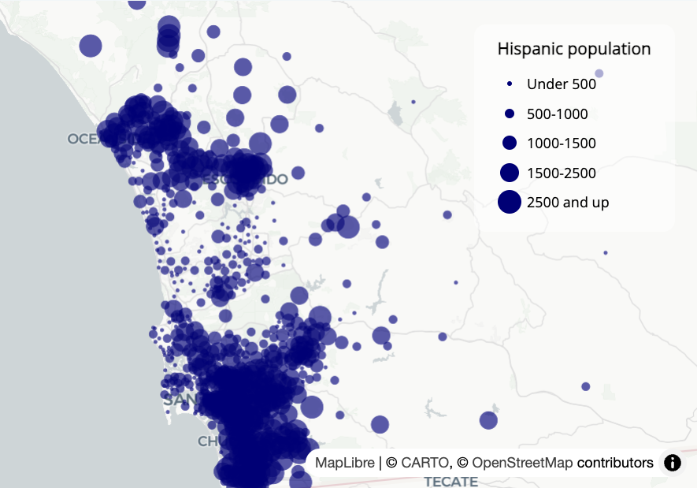

## Dot-density mapping

-   It can be difficult to show *heterogeneity* or *mixing* of different categories on maps

-   Dot-density maps scatter dots proportionally to data size; dots can be colored to show mixing of categories

-   Traditionally, dot-density maps are slow to make in R; tidycensus's `as_dot_density()` function addresses this

## Dot-density mapping

```{r build-dots}
#| eval: true

san_diego_race_dots <- as_dot_density(
  san_diego_race,
  value = "estimate",
  values_per_dot = 200,
  group = "variable"
)
```

------------------------------------------------------------------------

```{r show-dots}
san_diego_race_dots
```

## Dot-density mapping

```{r dot-plot}
#| eval: false

library(RColorBrewer)

groups <- unique(san_diego_race_dots$variable)
colors <- brewer.pal(length(groups), "Set1")

dot_density_map <- maplibre(
  style = carto_style("positron"),
  bounds = san_diego_race_dots
) |> 
  add_circle_layer(
    id = "dots",
    source = san_diego_race_dots,
    circle_color = match_expr(
      column = "variable",
      values = groups,
      stops = colors
    ), 
    circle_radius = 2
  )
```

------------------------------------------------------------------------

```{r sd-dot-map}
#| eval: false

dot_density_map
```

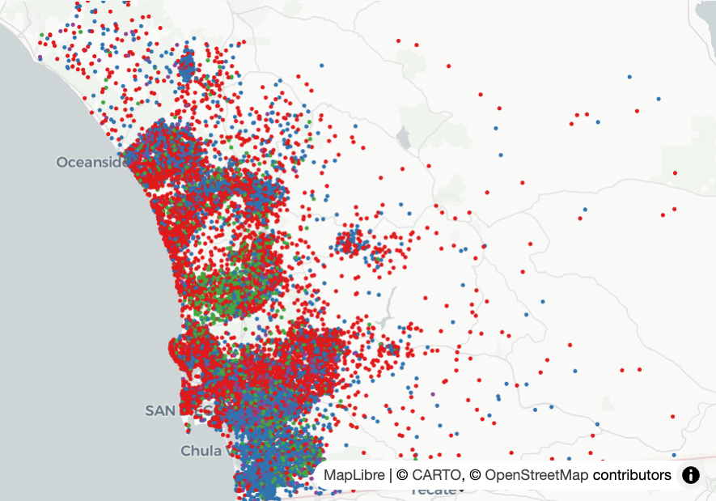

## Styling by zoom level

```{r}
#| eval: false

dot_density_map2 <- maplibre(
  style = carto_style("positron"),
  bounds = san_diego_race_dots
) |> 
  add_circle_layer(
    id = "dots",
    source = san_diego_race_dots,
    circle_color = match_expr(
      column = "variable",
      values = groups,
      stops = colors
    ), 
    circle_radius = interpolate(
      property = "zoom",
      values = c(9, 14),
      stops = c(1, 10)
    ),
    before_id = "watername_ocean"
  ) |> 
  add_legend(
    "Race/ethnicity in San Diego<br>1 dot = 200 people",
    values = groups,
    colors = colors,
    circular_patches = TRUE,
    type = "categorical"
  )
```

------------------------------------------------------------------------

```{r}
#| eval: false

dot_density_map2
```

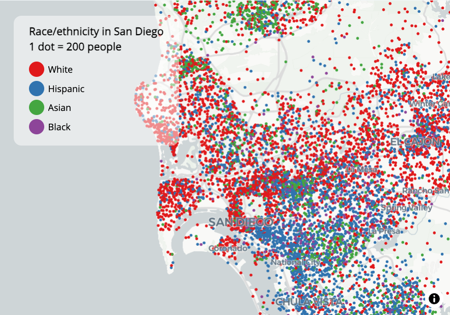

------------------------------------------------------------------------

## Part 2 exercises

-   Try reproducing one of the maps you created in this section with a different state / county combination. What patterns do you observe?

# Advanced workflows: national mapping and small-area time series analysis

# National mapping with shifted geometries

## The challenge of mapping the entire US

-   Alaska, Hawaii, and Puerto Rico are distant from continental US
-   Default Mercator projection inflates Alaska's size
-   Visual comparisons are difficult on tiled interactive maps

## Default national mapping

-   Let's plot median home value from the 2023 ACS by state

```{r}
library(dplyr)

us_value <- get_acs(
  geography = "state",
  variables = "B25077_001",
  year = 2023,
  survey = "acs1",
  geometry = TRUE,
  resolution = "5m"
) 

r <- range(us_value$estimate, na.rm = TRUE)

us_map1 <- maplibre(
  style = carto_style("positron"),
  bounds = us_value
) |> 
  add_fill_layer(
    id = "value",
    source = us_value,
    fill_color = interpolate(
      column = "estimate",
      values = r,
      stops = c("#1D00FC", "#00FF2F")
    ),
    fill_opacity = 0.7
  )
```

------------------------------------------------------------------------

```{r}
us_map1
```

------------------------------------------------------------------------

## What about a globe projection?

```{r}
us_map2 <- maplibre(
  style = carto_style("positron"),
  bounds = us_value
) |> 
  set_projection("globe") |> 
  add_fill_layer(
    id = "value",
    source = us_value,
    fill_color = interpolate(
      column = "estimate",
      values = r,
      stops = c("#1D00FC", "#00FF2F")
    ),
    fill_opacity = 0.7
  )
```

------------------------------------------------------------------------

```{r}
us_map2
```

## Shifting geometries for better visualization

-   Solution: use `shift_geometry()` from the tigris package
-   Shifts and rescales Alaska, Hawaii, and Puerto Rico

---

```{r}
library(tigris)

us_value_shifted <- shift_geometry(us_value)

us_map3 <- maplibre(
  style = carto_style("positron"),
  bounds = us_value_shifted
) |> 
  set_projection("globe") |> 
  add_fill_layer(
    id = "value",
    source = us_value_shifted,
    fill_color = interpolate(
      column = "estimate",
      values = r,
      stops = c("#1D00FC", "#00FF2F")
    ),
    fill_opacity = 0.7
  )
```

------------------------------------------------------------------------

```{r}
us_map3
```

## Working with shifted geometries

-   Problem: Shifted Alaska and Hawaii appear over Mexico
-   Solution: Remove the basemap entirely

## Creating a custom blank basemap

-   Two approaches:
    1.  Create a blank style in Mapbox Studio (if using Mapbox)
    2.  Build a style JSON from scratch

## Using a custom blank basemap with Albers projection

```{r}
#| eval: false

style_url <- "mapbox://styles/kwalkertcu/clz2wwap502f301pafh8ad1zv/draft"

us_value_shifted$tooltip <- paste0(us_value_shifted$NAME, ": $", us_value_shifted$estimate)

mapboxgl(
  style = style_url,
  projection = "albers",
  center = c(-98.8, 37.68),
  zoom = 2.5
) |> 
  add_fill_layer(
    id = "value",
    source = us_value_shifted,
    fill_color = interpolate(
      column = "estimate",
      values = r,
      stops = c("#1D00FC", "#00FF2F")
    ),
    fill_opacity = 0.7,
    tooltip = "tooltip"
  )
```

## Building a blank basemap from scratch

```{r}
us_value_shifted$tooltip <- paste0(us_value_shifted$NAME, ": $", us_value_shifted$estimate)

style <- list(
  version = 8,
  sources = structure(list(), .Names = character(0)),
  layers = list(
    list(
      id = "background",
      type = "background",
      paint = list(
        `background-color` = "lightgrey"
      )
    )
  )
)

us_map4 <- maplibre(
  style = style,
  center = c(-98.8, 37.68),
  zoom = 2.5
) |> 
  add_fill_layer(
    id = "value",
    source = us_value_shifted,
    fill_color = interpolate(
      column = "estimate",
      values = r,
      stops = c("#1D00FC", "#00FF2F")
    ),
    fill_opacity = 0.7,
    tooltip = "tooltip"
  )
```

------------------------------------------------------------------------

```{r}
us_map4
```

# National mapping for small areas

## Mapping census tracts across the US

-   Use case: Census results or national election data
-   Let's map median household income for all US Census tracts

---

```{r}
#| eval: false

library(tidycensus)
options(tigris_use_cache = TRUE)

# To run the code: 
#
# us_income <- get_acs(
#   geography = "tract",
#   variables = "B19013_001",
#   state = c(state.abb, "DC", "PR"),
#   year = 2023,
#   geometry = TRUE,
#   resolution = "5m"
# )

# To read in the data: 

us_income <- read_rds("data/us_tract_income.rds")

us_income
```

## Initial national tracts map

-   Our dataset has over 85,000 Census tracts!

```{r}
#| eval: false

maplibre(
  style = carto_style("positron"),
  center = c(-98.5795, 39.8283),
  zoom = 3
) |>
  set_projection("globe") |> 
  add_fill_layer(
    id = "fill-layer",
    source = us_income,
    fill_color = interpolate(
      column = "estimate",
      values = c(10000, 72000, 250000),
      stops = c("#edf8b1", "#7fcdbb", "#2c7fb8"),
      na_color = "lightgrey"
    ),
    fill_opacity = 0.7,
    tooltip = "estimate"
  )
```

---

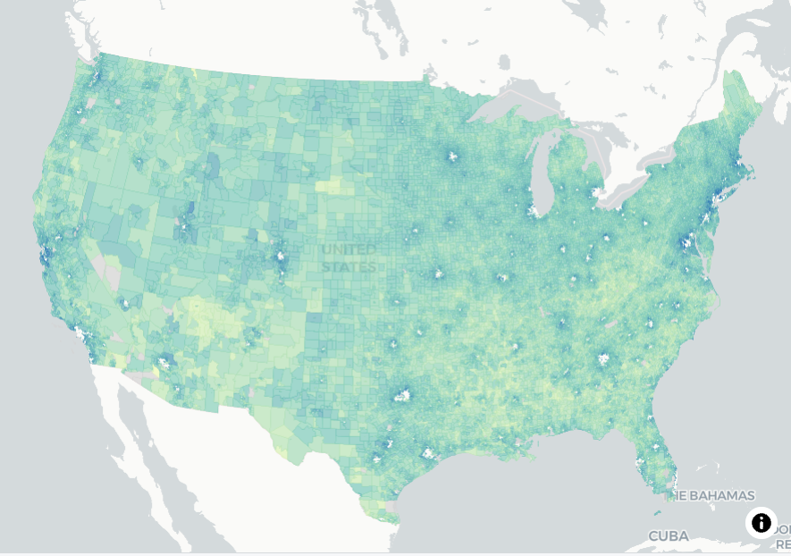

## The issue of geometry simplification

-   Notice the "holes" in large cities at initial zoom level
-   Cause: Douglas-Peucker simplification algorithm
-   Default tolerance (0.375) = \~5.6km at zoom level 3
-   Small Census tracts get dropped from the map!

## Disabling simplification

-   Solution: Set simplification tolerance to 0
-   Use `add_source()` with `tolerance = 0`

---

```{r}
#| eval: false

maplibre(
  style = carto_style("positron"),
  center = c(-98.5795, 39.8283),
  zoom = 3
) |>
  set_projection("globe") |> 
  add_source( 
    id = "us-tracts",
    data = us_income,
    tolerance = 0
  ) |> 
  add_fill_layer(
    id = "fill-layer",
    source = "us-tracts",
    fill_color = interpolate(
      column = "estimate",
      values = c(10000, 72000, 250000),
      stops = c("#edf8b1", "#7fcdbb", "#2c7fb8"),
      na_color = "lightgrey"
    ),
    fill_opacity = 0.7,
    tooltip = "estimate"
  )
```

---

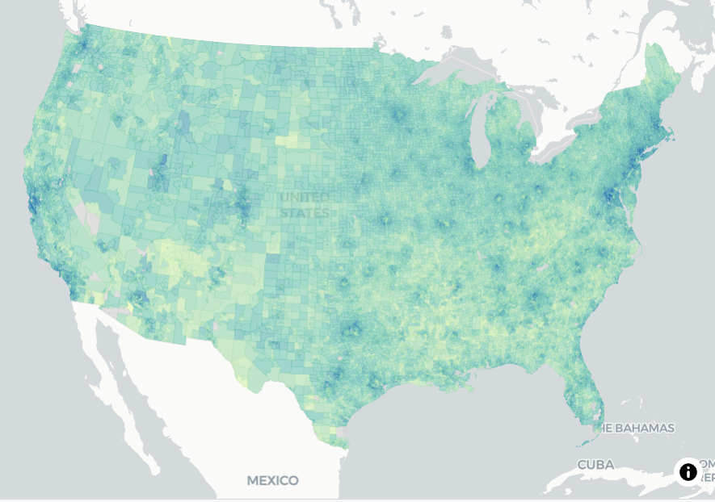

## Trade-offs of disabling simplification

-   No more holes at small zooms
-   But: Slower loading times
-   Poorer map performance

## Using zoom-dependent layering

-   Do you need all that detail when zoomed out?
-   Consider using different geographies at different zoom levels
-   Counties at low zoom, tracts at high zoom

## Adding county-level data

```{r}
#| eval: false

us_county_income <- get_acs(
  geography = "county",
  variables = "B19013_001",
  year = 2023,
  geometry = TRUE,
  resolution = "5m"
) 
```

## Implementing zoom-dependent layers

-   Tracts: `min_zoom = 8`
-   Counties: `max_zoom = 7.99`

---

```{r}
#| eval: false

maplibre(
  style = carto_style("positron"),
  center = c(-98.5795, 39.8283),
  zoom = 3
) |>
  set_projection("globe") |> 
  add_fill_layer(
    id = "fill-layer",
    source = us_income,
    fill_color = interpolate(
      column = "estimate",
      values = c(10000, 65000, 250000),
      stops = c("#edf8b1", "#7fcdbb", "#2c7fb8"),
      na_color = "lightgrey"
    ),
    fill_opacity = 0.7,
    min_zoom = 8,
    tooltip = "estimate"
  ) |> 
  add_fill_layer(
    id = "county-fill-layer",
    source = us_county_income,
    fill_color = interpolate(
      column = "estimate",
      type = "linear",
      values = c(10000, 65000, 250000),
      stops = c("#edf8b1", "#7fcdbb", "#2c7fb8"),
      na_color = "lightgrey"
    ),
    fill_opacity = 0.7,
    max_zoom = 7.99,
    tooltip = "estimate"
  ) |>
  add_continuous_legend(
    "Median household income",
    values = c("$10k", "$65k", "$250k"),
    colors = c("#edf8b1", "#7fcdbb", "#2c7fb8")
  )
```

# Comparing demographic change between 2010 and 2020

## The challenge of comparing small areas over time

-   Census tracts change between decennial censuses
-   No easy 1:1 comparisons for small areas

## Getting population density data for DFW

```{r, message = FALSE, warning = FALSE}
#| eval: false

library(tidycensus)
library(sf)
library(tidyverse)
library(tigris)
options(tigris_use_cache = TRUE)

dfw_counties <- counties(year = 2020) %>%
  filter(CBSAFP == "19100") %>%
  pull(COUNTYFP)

# 2010 variable lookup
vars10 <- load_variables(2010, "sf1")

dfw_pop_10 <- get_decennial(
  geography = "tract",
  state = "TX",
  county = dfw_counties,
  variables = "P001001",
  sumfile = "sf1",
  year = 2010,
  geometry = TRUE
) %>%
  st_transform(26914) %>%
  mutate(pop_density = as.numeric(value / (st_area(.) / 2589989.1738453)) )

dfw_pop_20 <- get_decennial(
  geography = "tract",
  variables = "P1_001N",
  state = "TX",
  county = dfw_counties,
  geometry = TRUE,
  year = 2020,
  sumfile = "dhc"
) %>%
  st_transform(26914) %>%
  mutate(pop_density = as.numeric(value / (st_area(.) / 2589989.1738453)) )

print(nrow(dfw_pop_10))
print(nrow(dfw_pop_20))
```

## The changing tract landscape

-   1,312 Census tracts in DFW in 2010
-   1,704 Census tracts in DFW in 2020

## Using the compare() function for side-by-side maps

```{r}
#| eval: false

m10 <- maplibre(
  style = carto_style("positron"),
) |> 
  fit_bounds(dfw_pop_10, animate = FALSE) |> 
  add_fill_layer(
    id = "dfw10",
    source = dfw_pop_10,
    fill_color = interpolate(
      column = "pop_density",
      values = seq(0, 40000, 8000),
      stops = plasma(6)
    ), 
    fill_opacity = 0.7
  ) |> 
  add_legend(
    "Population density (persons/sqmi)<br>Left: 2010, Right: 2020", 
    values = c("0", "8k", "16k", "24k", "32k", "40k"),
    colors = plasma(6)
  )

m20 <- maplibre(
  style = carto_style("positron"),
) |> 
  add_fill_layer(
    id = "dfw20",
    source = dfw_pop_20,
    fill_color = interpolate(
      column = "pop_density",
      values = seq(0, 40000, 8000),
      stops = plasma(6)
    ), 
    fill_opacity = 0.7
  ) 

compare(m10, m20) 
```

## Creating 3D extrusion maps for better visualization

-   Small high-density tracts can be hard to see
-   Solution: Use 3D extrusions to show density values
-   Add animation for better user experience

---

```{r}
#| eval: false

m10_3d <- maplibre(
  style = carto_style("positron")
) |> 
  fit_bounds(dfw_pop_10) |> 
  add_fill_extrusion_layer(
    id = "dfw10",
    source = dfw_pop_10,
    fill_extrusion_color = interpolate(
      column = "pop_density",
      values = seq(0, 40000, 8000),
      stops = plasma(6)
    ), 
    fill_extrusion_opacity = 0.7,
    fill_extrusion_height = get_column("pop_density")
  ) |> 
  add_legend(
    "Population density (persons/sqmi)<br>Left: 2010, Right: 2020", 
    values = c("0", "8k", "16k", "24k", "32k", "40k"),
    colors = plasma(6)
  )

m20_3d <- maplibre(
  style = carto_style("positron"),
) |> 
  add_fill_extrusion_layer(
    id = "dfw20",
    source = dfw_pop_20,
    fill_extrusion_color = interpolate(
      column = "pop_density",
      values = seq(0, 40000, 8000),
      stops = plasma(6)
    ), 
    fill_extrusion_opacity = 0.7,
    fill_extrusion_height = get_column("pop_density")
  ) |> 
  add_legend(
    "Population density (persons/sqmi)<br>Left: 2010, Right: 2020", 
    values = c("0", "8k", "16k", "24k", "32k", "40k"),
    colors = plasma(6)
  )

compare(m10_3d, m20_3d) 
```

# Bonus (if time): aligning geographies with spatial analysis

# Thank you!
